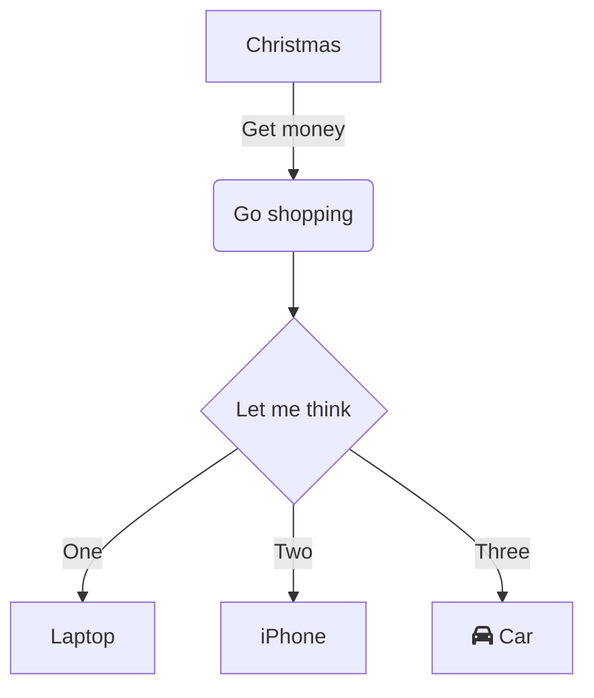

# gfm-diagram
search hack 2020

<!-- gfmd-start -->

Diagram source code

```mermaid
graph TD
A[Christmas] -->|Get money| B(Go shopping)
B --> C{Let me think}
C -->|One| D[Laptop]
C -->|Two| E[iPhone]
C -->|Three| F[fa:fa-car Car]
```

<!-- gfmd-end -->
