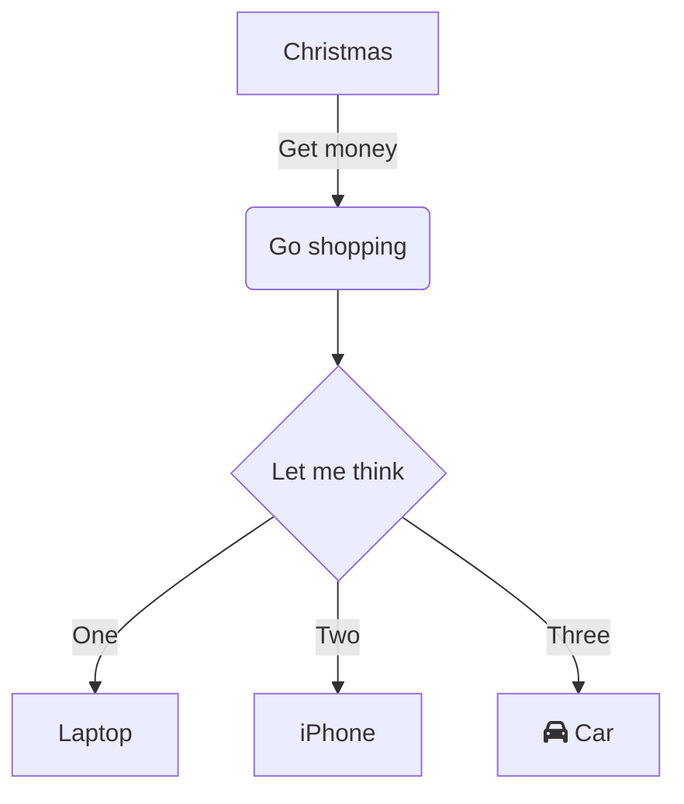

# GFM Diagram

> From [cookpad](https://cookpad.com) search hack 2020

**Get rendered [Mermaid](https://mermaid-js.github.io/mermaid/#/) diagrams in github markdown previews**

Unlike gitlab, github does not provide a way to embed diagram in markdown. This project aims to make it easier to communicate with diagrams, but without requiring a documentation generator.

Possible use cases:
- Projects which use markdown for their documentation
- Source controlled diagrams
- Very simple blogs

Powered by the diagram rendering service provided by https://kroki.io/#how

## This project provides

1. A github action to add rendered diagrams to markdown
2. **comming soon** A git precommit hook to reduce the need for additional commits from the github action

## Example

I want to add a diagram to a markdown file, I can add:

````
    ```mermaid
    graph TD
    A[Christmas] -->|Get money| B(Go shopping)
    B --> C{Let me think}
    C -->|One| D[Laptop]
    C -->|Two| E[iPhone]
    C -->|Three| F[fa:fa-car Car]
    ```
````
I then simply place it between &lt;!-- gfmd-start --> and &lt;!-- gfmd-end --> tags in order for GFM Diagram to recognize and add the rendered diagram as follows:

<!-- gfmd-start -->


<details>
<summary><sup><sub>Diagram source code</sub></sup></summary>


</details>
<!-- gfmd-end -->

The diagram source code remains in the markdown, and it available in a &lt;details> block in order to permit updating the diagram source in future.

## Installation

### Github action

The action provided by this project needs a surrounding workflow. The following example workflow shows how one would have github actions re-render and commit updated markdown for all non-main branches. The workflow will only run when markdown files have been updated and not commit if no changes are made.

Add a `.github/workflows/gfm-diagram.yml` file containing:
```
name: 'Render Mermaid in Markdown'

on:
  push:
    paths:
      - '**/*.md'
    branches-ignore:
      - "master"
      - "main"

jobs:
  mermaid:

    name: "Update mermaid diagram renders in Markdown"
    runs-on: ubuntu-latest
    if: "!contains(github.event.head_commit.message, 'ci skip') && !contains(github.event.head_commit.message, 'skip ci')"

    steps:
    - uses: actions/checkout@v2
      with:
        fetch-depth: 2

    # Find any updated markdown files
    - name: get changed files
      id: getfile
      run: |
        echo "::set-output name=files::$(git diff-tree --no-commit-id --name-only -r ${{ github.sha }} | grep -e '.*\.md$' | xargs)"
    - name: md files changed
      if: ${{steps.getfile.outputs.files}} != ""
      run: |
        echo ${{ steps.getfile.outputs.files }}

    # Re-render
    - name: compile mermaid
      if: ${{steps.getfile.outputs.files}} != ""
      uses: ./
      with:
        files: ${{ steps.getfile.outputs.files }}
    - name: show changes
      if: ${{steps.getfile.outputs.files}} != ""
      run: |
        git status

    # Commit and push back changes
    - name: Commit files
      if: ${{steps.getfile.outputs.files}} != ""
      run: |
        git config --local user.email "action@github.com"
        git config --local user.name "GitHub Action"
        git commit -m "Updated markdown diagrams [ci skip]" -a
    - name: Push changes
      if: ${{steps.getfile.outputs.files}} != ""
      uses: ad-m/github-push-action@master
      with:
        github_token: ${{ secrets.GITHUB_TOKEN }}

```

### Precommit hook

In your project, install [precommit](https://pre-commit.com/), then add the following to `.pre-commit-config.yaml`:

```
repos:
  - repo: https://github.com/cookpad/gfm-diagram
    hooks:
      - id: gfmd
```

When you commit a change to a diagram, an updated kroki link will be added, and the CI will not add a second commit to update the diagram.

## Roadmap

- [x] Basic github action
- [x] Basic precommit hook
- [ ] Tests
- [ ] Option to use local mermaid cli to render and store images locally
- [ ] Better markdown parsing

## With thanks to

1. [Mermaid](https://mermaid-js.github.io/mermaid/#/)
1. [compile-mermaid-markdown-action](https://github.com/neenjaw/compile-mermaid-markdown-action) which was used as inspiration

